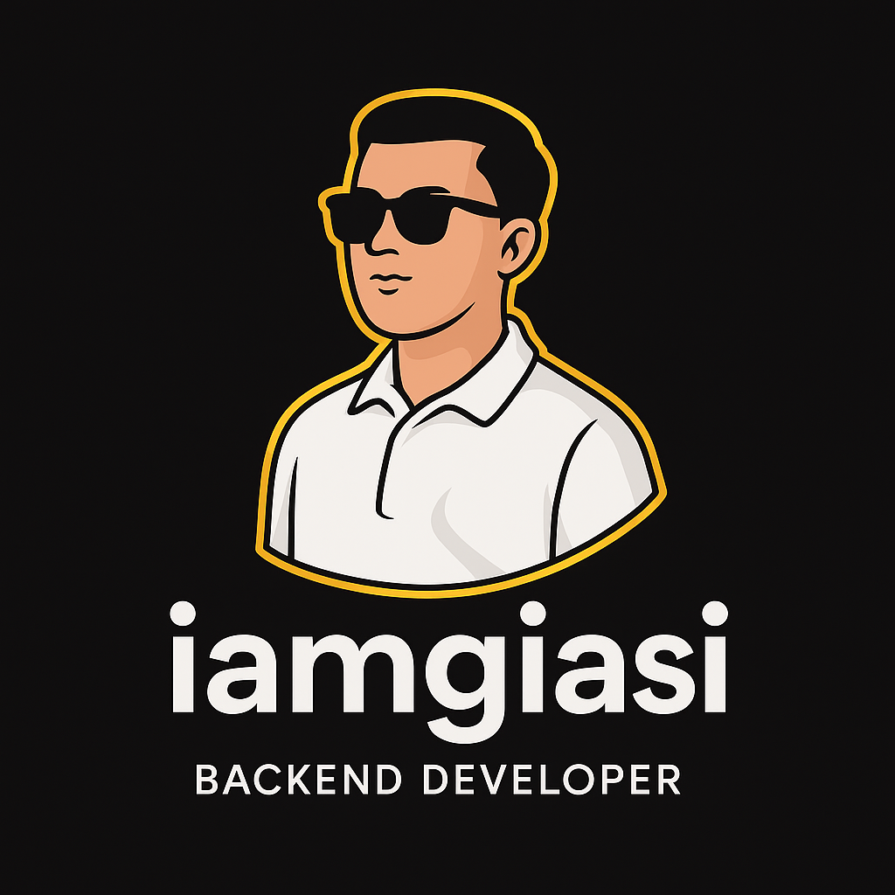
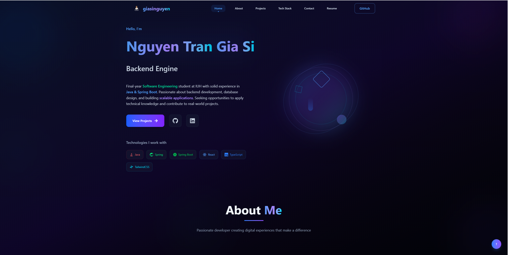

<div align="center">



# ✨ GiaSi Dev Portfolio

### A Modern, Performance-Optimized Personal Portfolio

[](https://reactjs.org/)
[](https://vitejs.dev/)
[](https://tailwindcss.com/)
[](https://www.framer.com/motion/)

[](https://nguyentrangiasi.id.vn)
[](https://github.com/giasinguyen/giasi-dev-portfolio)

---

</div>

<div align="center">

</div>

## 🚀 Overview

A cutting-edge personal portfolio website showcasing modern web development practices. Built with React 19, featuring stunning animations, responsive design, and optimized performance for all devices.

## ✨ Key Features

<table>
<tr>
<td width="50%">

### 🎨 **Design & UX**
- 🌙 **Dark Theme** with glass morphism effects
- 📱 **Fully Responsive** - Mobile-first approach
- ✨ **Smooth Animations** with Framer Motion
- 🎭 **Interactive Elements** and micro-interactions
- 🎨 **Modern UI/UX** with clean aesthetics

</td>
<td width="50%">

### ⚡ **Performance & Tech**
- ⚡ **Lightning Fast** with Vite 6
- 🏗️ **Component Architecture** with React 19
- 📦 **Optimized Bundle** size
- 🔍 **SEO Ready** with meta tags
- 📊 **Performance Monitoring** built-in

</td>
</tr>
</table>

## �️ Tech Stack

<div align="center">

| Frontend | Build & Tools | Styling | Animation | Deployment |
|:--------:|:-------------:|:-------:|:---------:|:----------:|
|  |  |  |  |  |
|  |  |  |  |  |

</div>

## 🎯 Project Highlights

<details>
<summary>🏠 <strong>Home Section</strong></summary>

- Hero animation with CSS-based geometric shapes
- Typewriter effect for dynamic text
- Particle background system
- Responsive design optimization

</details>

<details>
<summary>👨‍💻 <strong>About Section</strong></summary>

- Personal introduction with avatar
- Skills showcase with interactive elements
- GitHub contributions calendar integration
- Professional experience timeline

</details>

<details>
<summary>🎨 <strong>Projects Showcase</strong></summary>

- Dynamic project filtering system
- Modern card layouts with hover effects
- Technology stack badges
- Live demo and GitHub links
- Alternating animations on scroll

</details>

<details>
<summary>📝 <strong>Blog System</strong></summary>

- Complete blog with search functionality
- Category filtering and tags
- Bookmark system for articles
- Modern card design with read time
- SEO optimized blog posts

</details>

<details>
<summary>📄 <strong>Resume Viewer</strong></summary>

- Interactive PDF resume viewer
- Download functionality
- Structured experience data
- Skills and education sections
- Professional timeline

</details>

<details>
<summary>📞 <strong>Contact Form</strong></summary>

- Professional contact form
- Form validation and error handling
- Glass morphism design
- Toast notifications
- Social media integration

</details>

## 🚀 Quick Start

<details>
<summary>📋 <strong>Prerequisites</strong></summary>

Make sure you have the following installed:
- Node.js (v18 or higher)
- npm or yarn package manager
- Git for version control

</details>

### 1️⃣ Clone the Repository

```bash
git clone https://github.com/giasinguyen/giasi-dev-portfolio.git
cd giasi-dev-portfolio
```

### 2️⃣ Install Dependencies

```bash
npm install
# or
yarn install
```

### 3️⃣ Start Development Server

```bash
npm run dev
# or
yarn dev
```

### 4️⃣ Build for Production

```bash
npm run build
# or
yarn build
```

## 📁 Project Structure

<details>
<summary>🗂️ <strong>View Project Architecture</strong></summary>

```
📦 giasi-dev-portfolio/
├── 📁 public/                         # Static assets
│   ├── 📄 documents/                  # Resume and documents
│   ├── 🖼️ avatar.jpg                  # Profile image
│   ├── 🖼️ logo.png                    # Brand logo
│   └── 🖼️ portfolio.PNG               # Preview image
├── 📁 src/
│   ├── 📁 components/                 # React components
│   │   ├── 📁 About/                  # About section
│   │   ├── 📁 Blog/                   # Blog system
│   │   ├── 📁 Contact/                # Contact form
│   │   ├── 📁 Home/                   # Landing page
│   │   ├── 📁 Layout/                 # Layout components
│   │   │   ├── 📁 Navigation/         # Navbar & Footer
│   │   │   ├── 📁 Background/         # Visual effects
│   │   │   ├── 📁 Utilities/          # Utility components
│   │   │   ├── 📁 Viewers/            # PDF viewers
│   │   │   └── 📁 Mobile/             # Mobile components
│   │   ├── 📁 Projects/               # Portfolio showcase
│   │   ├── 📁 Resume/                 # Resume section
│   │   ├── 📁 SEO/                    # SEO components
│   │   └── 📁 UI/                     # Reusable UI
│   ├── 📁 context/                    # React context
│   ├── 📁 data/                       # Static data
│   ├── 📁 hooks/                      # Custom hooks
│   ├── 📁 utils/                      # Utility functions
│   ├── 📄 App.jsx                     # Main app component
│   └── 📄 main.jsx                    # Entry point
├── 📄 package.json                    # Dependencies
├── 📄 tailwind.config.js              # Tailwind config
├── 📄 vite.config.js                  # Vite configuration
└── 📄 vercel.json                     # Deployment config
```

</details>

## 🎨 Customization Guide

<details>
<summary>⚙️ <strong>How to Customize</strong></summary>

### 🎭 Personal Information

Edit these files to add your information:

```javascript
// src/data/projects.json - Your projects
// src/data/blogPosts.json - Your blog posts
// src/components/About/About.jsx - Personal info
// public/documents/ - Add your resume PDF
```

### 🎨 Theme & Colors

Customize the theme in `tailwind.config.js`:

```javascript
theme: {
  extend: {
    colors: {
      primary: '#3b82f6',
      secondary: '#8b5cf6',
      // Add your custom colors
    }
  }
}
```

### 📱 Contact Information

Update contact details in:
- `src/components/Contact/Contact.jsx`
- `src/components/Layout/Navigation/Footer.jsx`

</details>

## 🚀 Deployment

<details>
<summary>☁️ <strong>Deployment Options</strong></summary>

### Vercel (Recommended)

[](https://vercel.com/new/clone?repository-url=https://github.com/giasinguyen/giasi-dev-portfolio)

### Netlify

[](https://app.netlify.com/start/deploy?repository=https://github.com/giasinguyen/giasi-dev-portfolio)

### Manual Deployment

```bash
# Build the project
npm run build

# Deploy the dist/ folder to your hosting provider
```

</details>

## 📊 Performance Metrics

<div align="center">

| Metric | Score | Status |
|:------:|:-----:|:------:|
| Performance | 95+ | ✅ Excellent |
| Accessibility | 100 | ✅ Perfect |
| Best Practices | 100 | ✅ Perfect |
| SEO | 100 | ✅ Perfect |

</div>

## 🤝 Contributing

<details>
<summary>🛠️ <strong>How to Contribute</strong></summary>

1. Fork the repository
2. Create your feature branch (`git checkout -b feature/amazing-feature`)
3. Commit your changes (`git commit -m 'Add amazing feature'`)
4. Push to the branch (`git push origin feature/amazing-feature`)
5. Open a Pull Request

## 📞 Contact

- **Portfolio**: [https://nguyentrangiasi.id.vn/](https://nguyentrangiasi.id.vn)
- **GitHub**: [https://github.com/giasinguyen](https://github.com/giasinguyen)
- **Email**: giasinguyentran@gmail.com
- **LinkedIn**: [https://www.linkedin.com/in/giasinguyen/](https://www.linkedin.com/in/giasinguyen)

---

Built with ❤️ by GiaSi Nguyen using modern web technologies
